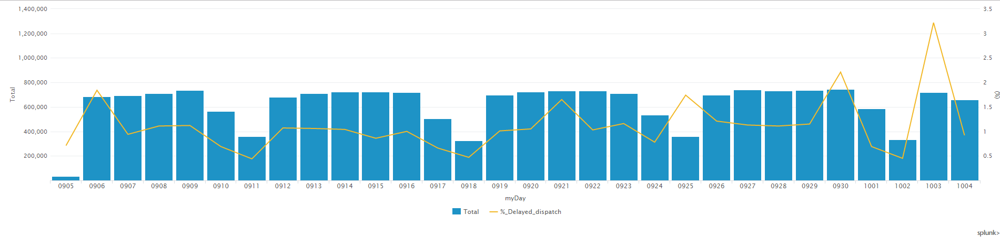
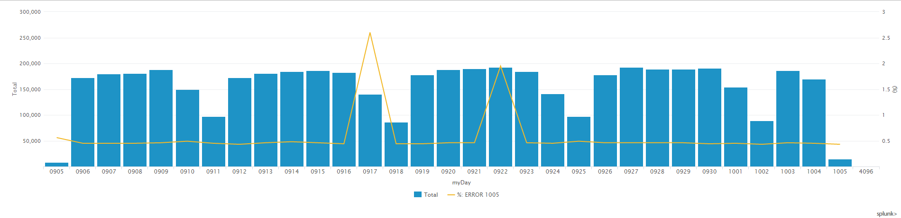
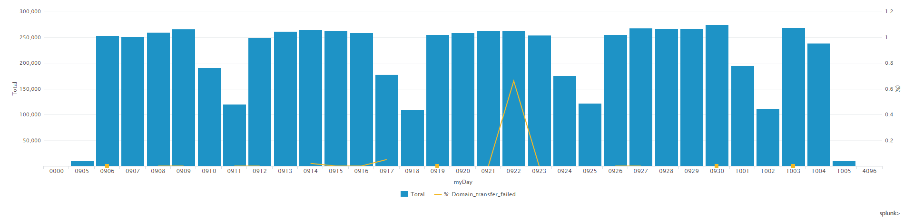
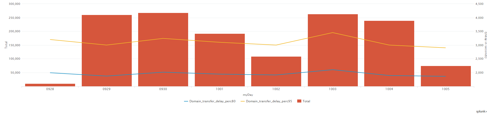

# TU Incoming call flow, Argentina

**IMPORTANT**: Note that the gCOB runlog files are sent to Splunk once they are completed. This means the data from the last days could be not complete (until the files get to 21Mb in gCOB sites).

## Incoming call CDR result

The following dashboard can be used to monitor the performance of the incoming call in Argentina deployment.

[Link to dashboard based on IP](https://10.253.1.11/en-US/app/tugo/report?sid=1466086202.183726.mia-spl-sch02&s=%2FservicesNS%2Fnobody%2Ftugo%2Fsaved%2Fsearches%2FTEEN_AR_Incoming_call_CDRs_resultcodes) / [Link to dashboard based on URL](https://mia-splunk.tefcomms.com/en-US/app/tugo/report?sid=1466086202.183726.mia-spl-sch02&s=%2FservicesNS%2Fnobody%2Ftugo%2Fsaved%2Fsearches%2FTEEN_AR_Incoming_call_CDRs_resultcodes)

Example:

See also [Incoming call Result Codes explanation](../../reportdata/Incoming_call_resultCodes_explanation.md) 

## Incoming call gBE delayed dispatchs

The following dashboard can be used to monitor the performance of the dispatchs coming from gBE to gCOB in the incoming call in Argentina deployment.

[Link to dashboard based on IP](https://10.253.1.11/en-US/app/tugo/report?sid=1466592172.629500.mia-spl-sch01&s=%2FservicesNS%2Fnobody%2Ftugo%2Fsaved%2Fsearches%2FTEEN_AR_Incoming_Call_delayed_dispatchs) / [Link to dashboard based on URL](https://mia-splunk.tefcomms.com/en-US/app/tugo/report?sid=1466592172.629500.mia-spl-sch01&s=%2FservicesNS%2Fnobody%2Ftugo%2Fsaved%2Fsearches%2FTEEN_AR_Incoming_Call_delayed_dispatchs)

Example:

## Incoming call Voicemail diversion errors

The following dashboard can be used to monitor the performance of the voicemail diversions in Argentina deployment. In this dashboard the evolution of the percentage of errors is shown.

[Link to dashboard based on IP](https://10.253.1.11/en-US/app/tugo/report?sid=1466595047.631627.mia-spl-sch01&s=%2FservicesNS%2Fnobody%2Ftugo%2Fsaved%2Fsearches%2FTEEN_AR_Incoming_call_VM_errors) / [Link to dashboard based on URL](https://mia-splunk.tefcomms.com/en-US/app/tugo/report?sid=1466595047.631627.mia-spl-sch01&s=%2FservicesNS%2Fnobody%2Ftugo%2Fsaved%2Fsearches%2FTEEN_AR_Incoming_call_VM_errors)

Example:

## Incoming call Domain Transfer failures

The following dashboard can be used to monitor the performance of the domain tranfer failures in Brazil deployment. This dashboard shows the global evolution of the percentage of errors in the last month.

[Link to dashboard based on IP](https://10.253.1.11/en-US/app/tugo/report?sid=1466595319.631800.mia-spl-sch01&s=%2FservicesNS%2Fnobody%2Ftugo%2Fsaved%2Fsearches%2FTEEN_AR_Incoming_call_Domain_transfer_errors) / [Link to dashboard based on URL](https://mia-splunk.tefcomms.com/en-US/app/tugo/report?sid=1466595319.631800.mia-spl-sch01&s=%2FservicesNS%2Fnobody%2Ftugo%2Fsaved%2Fsearches%2FTEEN_AR_Incoming_call_Domain_transfer_errors)

Example:

## Incoming call Domain Transfer Delay Percentile 80

The following dashboard can be used to monitor the performance of the domain tranfer delay percentile per area. This dashboard shows the percentile 80 of domain transfer delay for the last day per area.

[Link to dashboard based on IP](https://10.253.1.11/en-US/app/tugo/report?sid=1466612233.643981.mia-spl-sch01&s=%2FservicesNS%2Fnobody%2Ftugo%2Fsaved%2Fsearches%2FTEEN_AR_Incoming_call_Domain_tranfer_delay) / [Link to dashboard based on URL](https://mia-splunk.tefcomms.com/en-US/app/tugo/report?sid=1466612233.643981.mia-spl-sch01&s=%2FservicesNS%2Fnobody%2Ftugo%2Fsaved%2Fsearches%2FTEEN_AR_Incoming_call_Domain_tranfer_delay)

Example:

