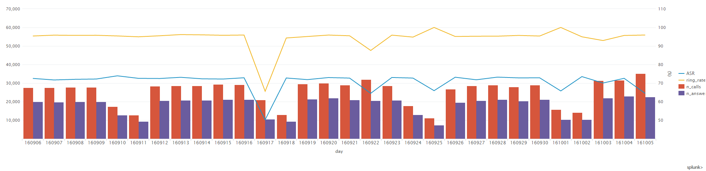
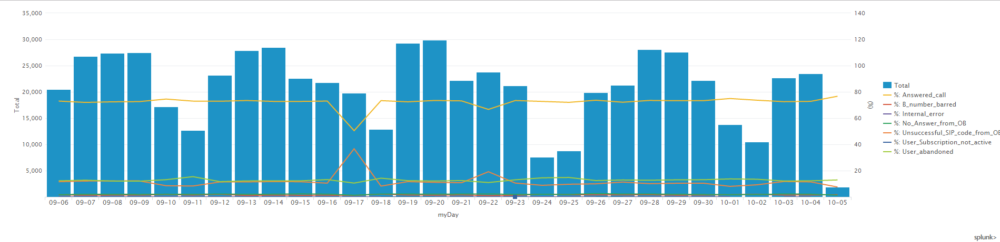

# TU App originated call flow, Argentina

The following splunk dashboards are the main source of monitoring:

## App Originated Call Evolution in Argentina

[Link to dashboard based on IP](https://10.253.1.11/en-US/app/tugo/report?sid=1466613049.644613.mia-spl-sch01&s=%2FservicesNS%2Fnobody%2Ftugo%2Fsaved%2Fsearches%2FTEEN_AR_Outgoing_call_conversion) / [Link to dashboard based on URL](https://mia-splunk.tefcomms.com/en-US/app/tugo/report?sid=1466613049.644613.mia-spl-sch01&s=%2FservicesNS%2Fnobody%2Ftugo%2Fsaved%2Fsearches%2FTEEN_AR_Outgoing_call_conversion)

Example:

See also [TU App originated call conversion explanation](../../reportdata/App_originated_call_conversion_explanation.md)

## gCOB CDRs for App Originated calls in Argentina

[Link to dashboard based on IP](https://10.253.1.11/en-US/app/tugo/report?sid=1466613194.644688.mia-spl-sch01&s=%2FservicesNS%2Fnobody%2Ftugo%2Fsaved%2Fsearches%2FTEEN_AR_Outgoing_call_CDRs) / [Link to dashboard based on URL](https://mia-splunk.tefcomms.comen-US/app/tugo/report?sid=1466613194.644688.mia-spl-sch01&s=%2FservicesNS%2Fnobody%2Ftugo%2Fsaved%2Fsearches%2FTEEN_AR_Outgoing_call_CDRs)

Example:

See also [TU App originated call](../../reportdata/App_Orig_call_resultCodes_explanation.md)
