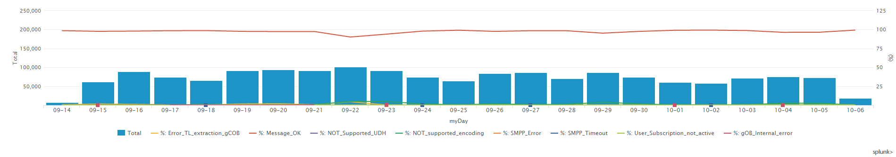

# TU NWC Incoming message, Brazil

**IMPORTANT**: Note that the gCOB runlog files are sent to Splunk once they are completed. This means the data from the last days could be not complete (until the files get to 21Mb in gCOB).

## Incoming NWC message CDR result

The following dashboards can be used to monitor the performance of the NWC incoming messages in Brazil deployment.
[Link to dashboard based on IP](https://10.253.1.11/en-US/app/tugo/report?sid=1465895519.45626.mia-spl-sch02&s=%2FservicesNS%2Fnobody%2Ftugo%2Fsaved%2Fsearches%2FTEEN_BR_Incoming_NWC_Message_CDRs) / [Link to dashboard based on URL](https://mia-splunk.tefcomms.com/en-US/app/tugo/report?sid=1465895519.45626.mia-spl-sch02&s=%2FservicesNS%2Fnobody%2Ftugo%2Fsaved%2Fsearches%2FTEEN_BR_Incoming_NWC_Message_CDRs)





Example:

See also [Incoming NWC message Result Codes explanation](../../reportdata/App_Orig_NWC_message_resultCodes_explanation.md) 
