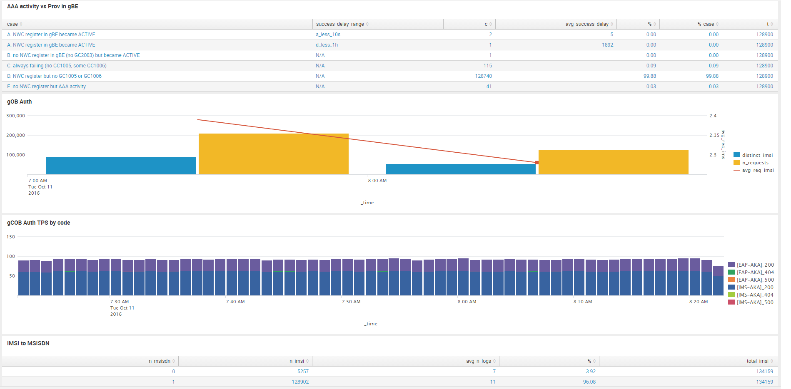

# TU NWC Provisioning flow, Brazil

##  NWC Provisioning in Brazil dashboard

The following dashboard shows the relevant information about the provisioning process for NWC users in Bra.

[Link to dashboard based on IP](https://10.253.1.11/en-US/app/tugo/nwc_prov?earliest=-60m%40m&latest=now) / [Link to dashboard based on URL](https://mia-splunk.tefcomms.com/en-US/app/tugo/nwc_prov?earliest=-60m%40m&latest=now)

Example:

See also [NWC Provisioning flow dashboard explanation](../../reportdata/NWC_Provisioning_dashboard_explanation.md) 
