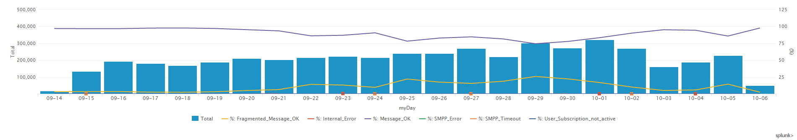
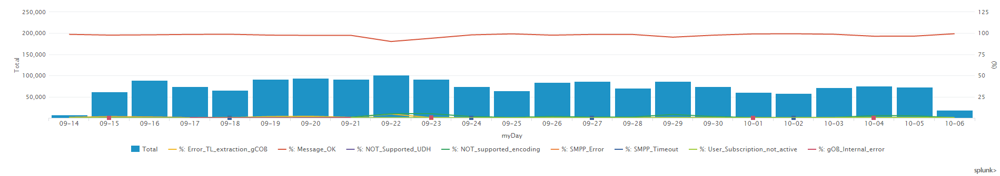

# TU App originated message, Brazil

**IMPORTANT**: Note that the gCOB runlog files are sent to Splunk once they are completed. This means the data from the last days could be not complete (until the files get to 21Mb). In App originated message flows, where there are few logs written, this effect can be noticeable.

## TU App originaged message CDR result

The following dashboards can be used to monitor the performance of the Vanilla app originated messages in Brazil deployment.

[Link to dashboard based on IP](https://10.253.1.11/en-US/app/tugo/report?sid=1465832743.3076.mia-spl-sch01&s=%2FservicesNS%2Fnobody%2Ftugo%2Fsaved%2Fsearches%2FTEEN_BR_Outgoing_Vanilla_Message_CDRs){:target="_blank"} / [Link to dashboard based on URL](https://mia-splunk.tefcomms.com/en-US/app/tugo/report?sid=1465832743.3076.mia-spl-sch01&s=%2FservicesNS%2Fnobody%2Ftugo%2Fsaved%2Fsearches%2FTEEN_BR_Outgoing_Vanilla_Message_CDRs){:target="_blank"}

Example:

See also [TU App originated message Result Codes explanation](../../reportdata/App_Orig_Vanilla_message_resultCodes_explanation.md)

## Outgoing NWC message CDR result

The following dashboards can be used to monitor the performance of the NWC originated messages in Brazil deployment.
[Link to dashboard based on IP](https://10.253.1.11/en-US/app/tugo/report?sid=1465834496.4062.mia-spl-sch01&s=%2FservicesNS%2Fnobody%2Ftugo%2Fsaved%2Fsearches%2FTEEN_BR_Outgoing_NWC_Message_CDRs)/ [Link to dashboard based on URL](https://mia-splunk.tefcomms.com/en-US/app/tugo/report?sid=1465834496.4062.mia-spl-sch01&s=%2FservicesNS%2Fnobody%2Ftugo%2Fsaved%2Fsearches%2FTEEN_BR_Outgoing_NWC_Message_CDRs)

Example:

See also [TU NWC originated message Result Codes explanation](../../reportdata/App_Orig_NWC_message_resultCodes_explanation.md)

