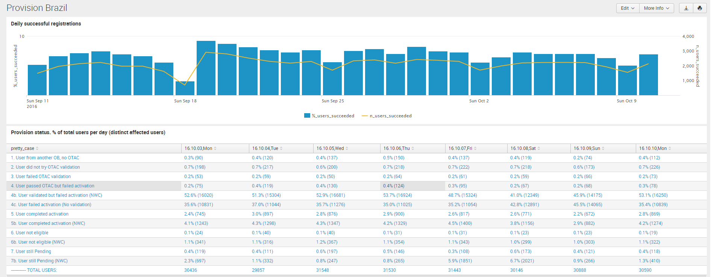

# TU Provisioning flow, Brazil

## Provisioning flow in Brazil dashboard

The following dashboard can be queried to check the evolution of the provisioning process in Brazil for the last days.

[Link to dashboard based on IP](https://10.253.1.11/en-US/app/tugo/provision_brasil?earliest=0&latest=) / [Link to dashboard based on URL](https://mia-splunk.tefcomms.com/en-US/app/tugo/provision_brasil?earliest=0&latest=)

Example:

See also [Provisioning flow in Brazil dashboard explanation](../../reportdata/Provisioning_dashboard_explanation.md) 

