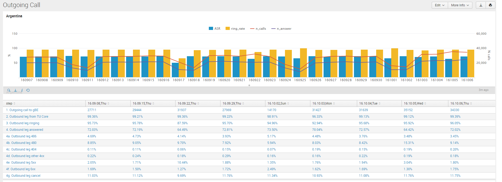

# APPLICATION ORIGINATED CALL TROUBLESHOOTING PROCEDURE

This document describes the basic operations troubleshooting procedure for the app originated flow. It describes briefly the proposed checks to be done for massive and single customer/call issues.

## MASSIVE ISSUES

### ASR decrease/ non successful responses increase

The typical problem in app originated call flow will be that a lower number of calls are responded by the users.
Note: In some countries (currently **Brazil**), it is required to do the analysis of the ASR per area of the calling number.

The proposed troubleshooting procedure is the following one:

#### STEP 1 -> Check if calls are getting to the OB or not.

First thing to do is to check this dashboard:

* Latam dashboard [based on IP](https://10.253.1.11/en-US/app/tugo/outgoing_call_conversion?earliest=0&latest=) or [based on URL](https://mia-splunk.tefcomms.com/en-US/app/tugo/outgoing_call_conversion?earliest=0&latest=).
* UK dashboard [based on IP](https://10.253.0.167/en-US/app/tugo/outgoing_call_conversion?earliest=0&latest=) or [based on URL](https://ldn-splunk.tefcomms.com/en-US/app/tugo/outgoing_call_conversion?earliest=0&latest=).

The following figure shows a screenshot of this dashboard for a particular country:

Check if the value of parameter **2. Outbound leg from TU Core** is high *(>98-99%)* or not:

* **If the value is low for that  OB** this means that *there's probably a problem bewteen the FreeSwitchs in TUCore and gBE*.
* **If the value is high** this discards problems in gBE and TUCore's FreeSwitchs. In this case we will have to check deeper in Voipmonitor statistics which error code increased and analyze some samples.
   * If the calls are not getting to the OB, there has to be a problem in TUCore platform (BES) or in some SBC (routing problem, other).
   * If the calls are getting to the OB, go to next step.

####  Step 2 -> Check why calls are failing in the OB

In case calls are failing in the OB, we have 2 sources of data to analyze what is going on:

1. **gConnectOB runlogs and CDRs**: we can try to analyze what has changed by querying in splunk for gCOB data:

   * Query for CDR result for outgoing calls in Brazil for all the areas [IP Based link](https://10.253.1.11/en-US/app/tugo/search?q=search%20sourcetype%3D%22CDR%20-%20gOB_BR%22%20%22CallType%3D\%22outgoing%22%20%7C%20%20rex%20%22CallingParty%3D\%220055%28%3F%3Ccalling_area%3E\d\d%29\d*%22%20%7C%20timechart%20span%3D1h%20count%20by%20CallResult&earliest=-30d%40d&latest=now&display.page.search.mode=fast&display.page.search.tab=visualizations&display.general.type=visualizations&sid=1464361705.273182.mia-spl-sch01) / [URL Based link](https://mia-splunk.tefcomms.com/en-US/app/tugo/search?q=search%20sourcetype%3D%22CDR%20-%20gOB_BR%22%20%22CallType%3D\%22outgoing%22%20%7C%20%20rex%20%22CallingParty%3D\%220055%28%3F%3Ccalling_area%3E\d\d%29\d*%22%20%7C%20timechart%20span%3D1h%20count%20by%20CallResult&earliest=-30d%40d&latest=now&display.page.search.mode=fast&display.page.search.tab=visualizations&display.general.type=visualizations&sid=1464361705.273182.mia-spl-sch01).

   * Query for CDR result in Brazil for an specific area (54 in the example) [IP Based link](https://10.253.1.11/en-US/app/tugo/search?q=search%20sourcetype%3D%22CDR%20-%20gOB_BR%22%20%22CallType%3D\%22outgoing%22%20%7C%20%20rex%20%22CallingParty%3D\%220055%28%3F%3Ccalling_area%3E\d\d%29\d*%22%20%7C%20where%20calling_area%3D54%20%7C%20timechart%20span%3D1h%20count%20by%20CallResult&earliest=-30d%40d&latest=now&display.page.search.mode=fast&display.page.search.tab=visualizations&display.general.type=visualizations&sid=1464361705.273182.mia-spl-sch01) / [URL Based link](https://mia-splunk.tefcomms.com/en-US/app/tugo/search?q=search%20sourcetype%3D%22CDR%20-%20gOB_BR%22%20%22CallType%3D\%22outgoing%22%20%7C%20%20rex%20%22CallingParty%3D\%220055%28%3F%3Ccalling_area%3E\d\d%29\d*%22%20%7C%20where%20calling_area%3D54%20%7C%20timechart%20span%3D1h%20count%20by%20CallResult&earliest=-30d%40d&latest=now&display.page.search.mode=fast&display.page.search.tab=visualizations&display.general.type=visualizations&sid=1464361705.273182.mia-spl-sch01).

   * Query for CDR result codes in whole Brazil [IP Based link](https://10.253.1.11/en-US/app/tugo/search?q=search%20sourcetype%3D%22CDR%20-%20gOB_BR%22%20%22CallType%3D\%22outgoing%22%20%7C%20%20rex%20%22CallingParty%3D\%220055%28%3F%3Ccalling_area%3E\d\d%29\d*%22%20%7C%20rex%20%22%28%3F%3CmyResult%3ESuccess%3D\%22[^\%22]*\%22%3BResultCode%3D\%22\d*\%22%29%22%20%7C%20%20timechart%20span%3D1h%20count%20by%20myResult&earliest=-30d%40d&latest=now&display.page.search.mode=fast&display.page.search.tab=visualizations&display.general.type=visualizations&sid=1464362657.274131.mia-spl-sch01) / [URL Based link ](https://mia-splunk.tefcomms.com/en-US/app/tugo/search?q=search%20sourcetype%3D%22CDR%20-%20gOB_BR%22%20%22CallType%3D\%22outgoing%22%20%7C%20%20rex%20%22CallingParty%3D\%220055%28%3F%3Ccalling_area%3E\d\d%29\d*%22%20%7C%20rex%20%22%28%3F%3CmyResult%3ESuccess%3D\%22[^\%22]*\%22%3BResultCode%3D\%22\d*\%22%29%22%20%7C%20%20timechart%20span%3D1h%20count%20by%20myResult&earliest=-30d%40d&latest=now&display.page.search.mode=fast&display.page.search.tab=visualizations&display.general.type=visualizations&sid=1464362657.274131.mia-spl-sch01).

   * Query for CDR result codes in some area (54 in the example) Brazil [IP Based link](https://10.253.1.11/en-US/app/tugo/search?q=search%20sourcetype%3D%22CDR%20-%20gOB_BR%22%20%22CallType%3D\%22outgoing%22%20%7C%20%20rex%20%22CallingParty%3D\%220055%28%3F%3Ccalling_area%3E\d\d%29\d*%22%20%7C%20where%20calling_area%3D54%20%7C%20rex%20%22%28%3F%3CmyResult%3ESuccess%3D\%22[^\%22]*\%22%3BResultCode%3D\%22\d*\%22%29%22%20%7C%20%20timechart%20span%3D1h%20count%20by%20myResult&earliest=-30d%40d&latest=now&display.page.search.mode=fast&display.page.search.tab=visualizations&display.general.type=visualizations&sid=1464362785.274320.mia-spl-sch01) / [URL Based link](https://mia-splunk.tefcomms.com/en-US/app/tugo/search?q=search%20sourcetype%3D%22CDR%20-%20gOB_BR%22%20%22CallType%3D\%22outgoing%22%20%7C%20%20rex%20%22CallingParty%3D\%220055%28%3F%3Ccalling_area%3E\d\d%29\d*%22%20%7C%20where%20calling_area%3D54%20%7C%20rex%20%22%28%3F%3CmyResult%3ESuccess%3D\%22[^\%22]*\%22%3BResultCode%3D\%22\d*\%22%29%22%20%7C%20%20timechart%20span%3D1h%20count%20by%20myResult&earliest=-30d%40d&latest=now&display.page.search.mode=fast&display.page.search.tab=visualizations&display.general.type=visualizations&sid=1464362785.274320.mia-spl-sch01).

   * Query for CDR result in Argentina [IP Based link](https://10.253.1.11/en-US/app/tugo/search?earliest=-7d%40d&latest=now&q=search%20sourcetype%3D%22CDR%20-%20gOB_AR%22%20%22CallType%3D\%22outgoing%22%20%7C%20timechart%20span%3D1h%20count%20by%20CallResult&display.page.search.tab=visualizations&display.general.type=visualizations&sid=1464362151.273731.mia-spl-sch01) / [URL Based link](https://mia-splunk.tefcomms.com/en-US/app/tugo/search?earliest=-7d%40d&latest=now&q=search%20sourcetype%3D%22CDR%20-%20gOB_AR%22%20%22CallType%3D\%22outgoing%22%20%7C%20timechart%20span%3D1h%20count%20by%20CallResult&display.page.search.tab=visualizations&display.general.type=visualizations&sid=1464362151.273731.mia-spl-sch01).

   * Query for CDR result codes in Argentina [IP Based link](https://10.253.1.11/en-US/app/tugo/search?earliest=-7d%40d&latest=now&q=search%20sourcetype%3D%22CDR%20-%20gOB_AR%22%20%22CallType%3D\%22outgoing%22%20%7C%20rex%20%22%28%3F%3CmyResult%3ESuccess%3D\%22[^\%22]*\%22%3BResultCode%3D\%22\d*\%22%29%22%20%7C%20timechart%20span%3D1h%20count%20by%20myResult&display.page.search.tab=visualizations&display.general.type=visualizations&sid=1464362444.274001.mia-spl-sch01) / [URL Based link](https://mia-splunk.tefcomms.com/en-US/app/tugo/search?earliest=-7d%40d&latest=now&q=search%20sourcetype%3D%22CDR%20-%20gOB_AR%22%20%22CallType%3D\%22outgoing%22%20%7C%20rex%20%22%28%3F%3CmyResult%3ESuccess%3D\%22[^\%22]*\%22%3BResultCode%3D\%22\d*\%22%29%22%20%7C%20timechart%20span%3D1h%20count%20by%20myResult&display.page.search.tab=visualizations&display.general.type=visualizations&sid=1464362444.274001.mia-spl-sch01).
   
   sourcetype="CDR-gOB_AR" "CallType=\"outgoing" | rex "(?<myResult>Success=\"\w+\";ResultCode=\"\d+\")" | timechart span=1h count by myResult

2. **Comm-reason header in SIP responses**:
   **Pending how to get that information from Splunk or Voipmonitor**

## SINGLE CALL/USER ISSUES

When troubleshooting specific calls, these are the steps that can be followed:

#### STEP 1

For the app originated flow, the first place to review the call is Voipmonitor [IP Based link](http://10.253.0.169/index.php) / [URL Based link](http://voipmonitor/index.php).

A basic manual for this tool can be found [here](voipmonitor_tutorial_intro.md).

It should be checked:

* The format of the number in the different headers is the appropriate for the specific country:
   * _Request URI_: The format of the number should be suitable for the OB
   * _To header_: The number in the To header should be the E.164 normalized version of the dialed number (for the platform to include the communication record in the appropriate timeline of the user).
* The INVITE gets to the SIP endpoint provided by the OB.

  From gConnectOB version 1.2.7.1 on, we included the service to put a Comm-Reason header in the unsuccessful response from gCOB towards TUCore. In case the call received some unsuccessful response in the OB, that Comm-Reason header will contain the SIP response that the OB equipment replied and the information provided by the OB in the Reason header. Note: This header is not available in Perú as in that country the outgoing calls does not traverse gConnectOB service.

  NOTE: If there is no SIP Reason header received from the OB, Comm-Reason header will contain just the cause parameter.

  The format of the Comm-Reason header is the following (this is an example):

   If the Reason received in the OB unsuccessful response is:

>  Reason: Q.850;cause=127;text="Interworking, unspecified"

 The Comm-Reason will have the following format

> Comm-Reason: OB;cause=xxx;text="Interworking, unspecified"; rcvdCause="127";rcvdProtocol="Q.850";

  where:

   * *cause=* will be XXX, where XXX is the sip response code received by gCOB.
   * *text=* will contain the value of the the "text" field in Reason if present.
   * *rcvdCause=* will contain the value of the cause field in original Reason
   * *rcvdProtocol=* will contain the protocol value after the Reason header.

   The format of the reason header in SIP can be checked [here](https://tools.ietf.org/html/rfc3326)

#### STEP 2

In case the call is getting to the OB and we can't identify the reason, you can check the **Call investigations v2** dashboard [Latam IP Based link](https://10.253.1.11/en-US/app/tugo/call_investigations_v2?earliest=-24h%40h&latest=now) / [Latam URL Based link](https://mia-splunk.tefcomms.com/en-US/app/tugo/call_investigations_v2?earliest=-24h%40h&latest=now) / [UK IP Based link](https://10.253.0.167/en-US/app/tugo/call_investigations?earliest=-24h%40h&latest=now) / [UK URL Based link](https://ldn-splunk.tefcomms.com/en-US/app/tugo/call_investigations?earliest=-24h%40h&latest=now)

In this dashboard, with the callSessionID for the specific call (that can be obtained in Voipmonitor), you can check:

* The summary of the call, containing calling and called numbers, gBE action, etc.
* Voipmonitor link to look for the call in Voipmonitor.
* User Devices Activity: The information in the logs for the different devices of the user.
* Event and actions: events in gBE for the call for the specific call.
* Push notifications: push notification activity related to the call (only for incoming call).
* Errors and warnings: Error and warning logs for that session.
* BES logs: logs in the TUCore platform for that call.
* TU Core Requests: API traffic from gBE to TUCore for that call.
* gOB logs: gOB runlogs for that call.
