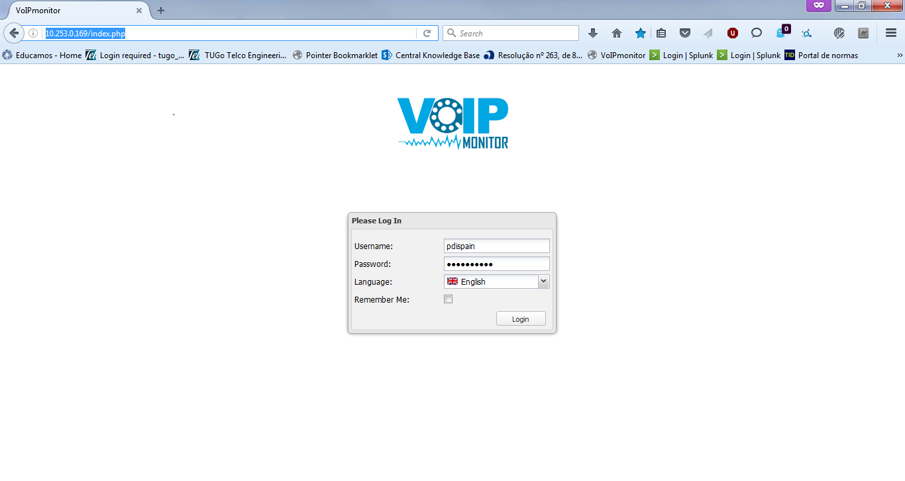
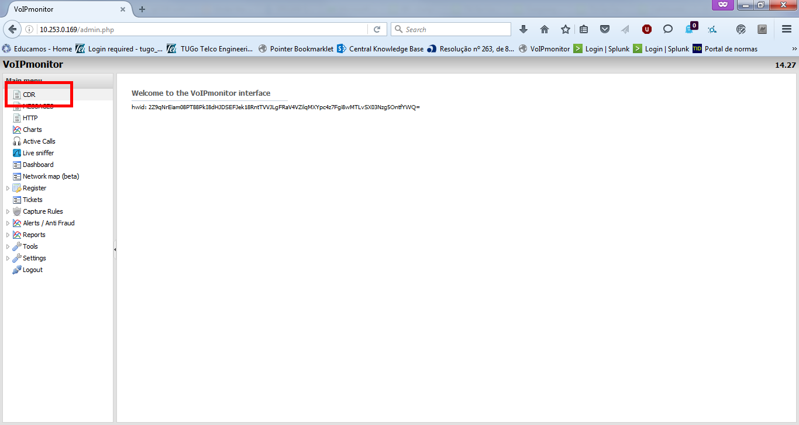
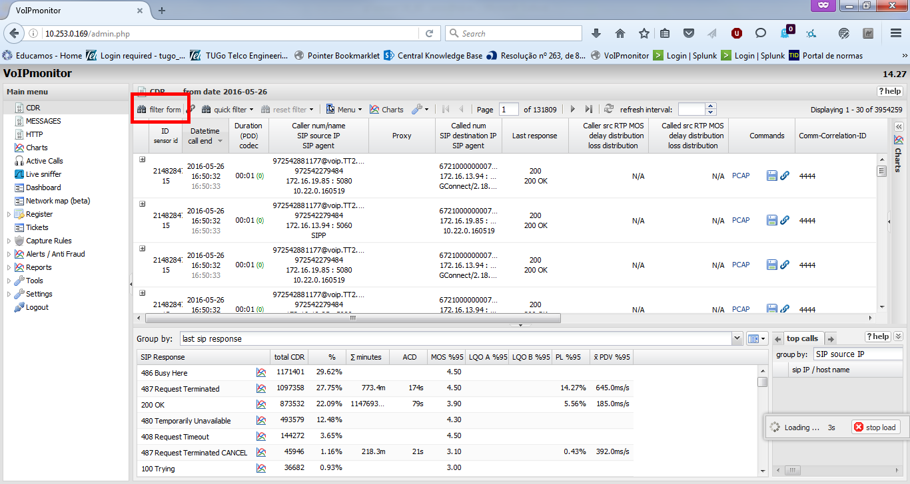
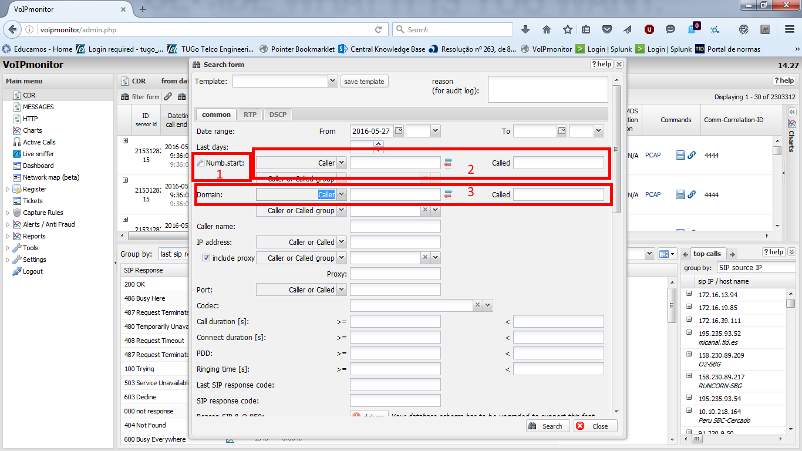
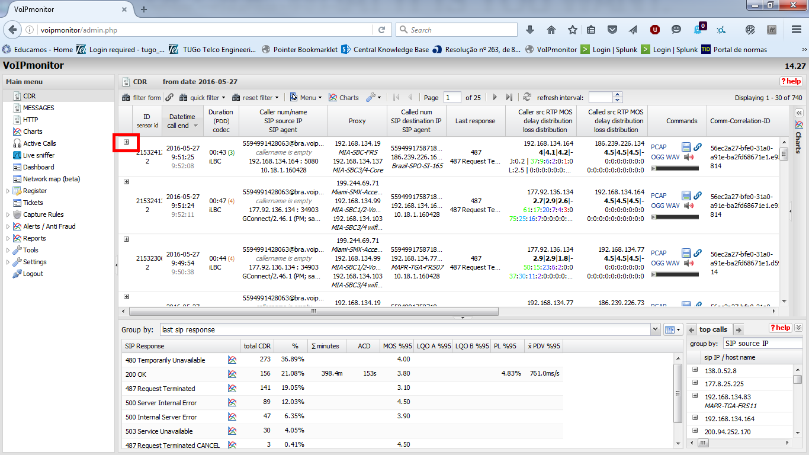
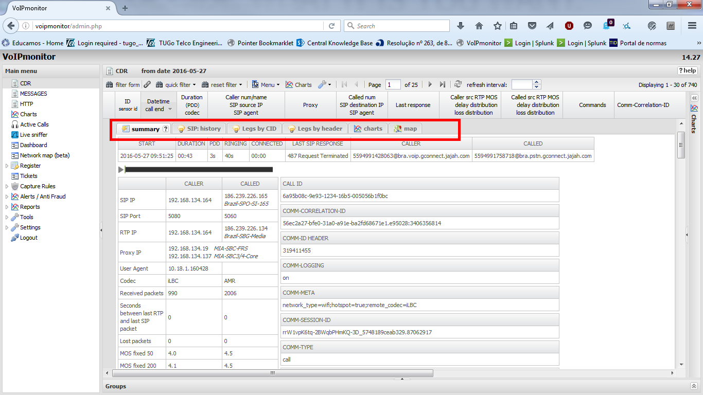
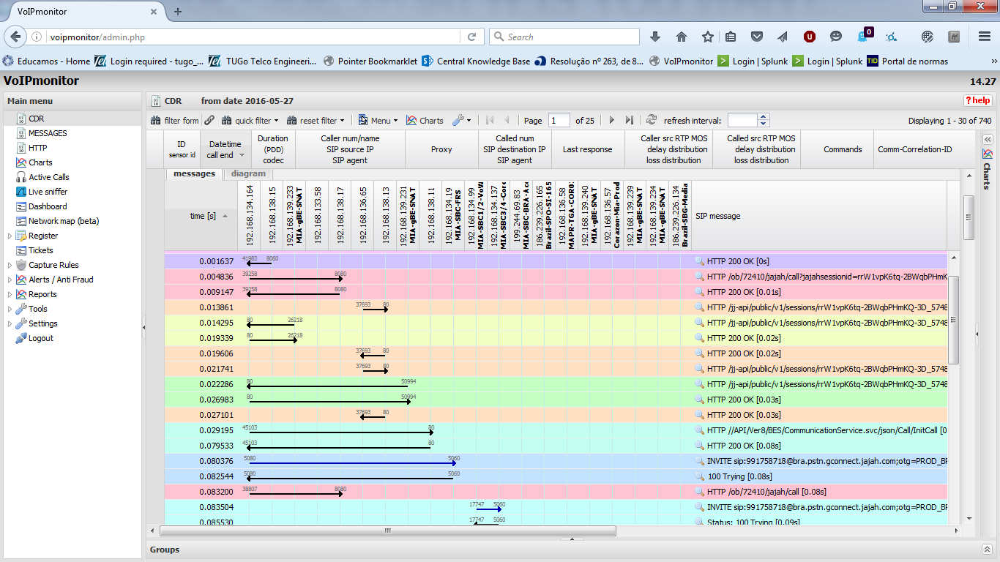

# Brief tutorial about the use of VoipMonitor tool

## Debugging a call in VoipMonitor

Steps to troubleshoot a call using the VoipMonitor tool are the following:

1. Login the VoipMonitor tool.

2. Select the call section, to get the menu for calls.

3. Select the call filter button.

4. Select the call filter button.

5. Include the apropriate filters in :
  * Selecting if we want to filter by complete number or just the start (1).
  * Include calling or called numbers (2).
  * Include the domain we want to filter also (3).

6. Then the calls that match the filter applied in the following screen, and we can open the details for a call clicking the "+"

7. Then we can use the following tabs in the details of the call.

  * *Summary*: contains a summary of the call, with media information, calling and called numbers, etc.
  * *SIP: history* shows a graph representation of the SIP and HTTP requests for that call.
  
  * *Legs by CallID*, looks for all the legs that match the callID, with the **merge** options we will be able to check all the SIP/HTTP for all the sessions matching the criteria.
  * *Legs by Header*, looks on all the call legs based on the correlation header. Again, with merge option we will be able to see the graph for all those legs.
  * *Charts* shows some graphs of the parameters of the call, like QoS for rtp stream, etc.
  * *Map*, georepresentation of the position of the parties in the call.
